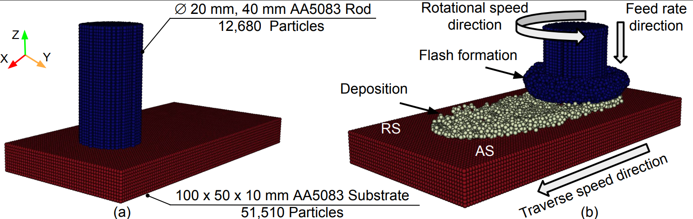

# FS-SPH-GPU-ESAFORM

##  Numerical investigation of deposition efficiency influencing factors in the friction surfacing process



## Installation

- [cuda-13.0](https://developer.nvidia.com/)
- [cmake](https://cmake.org/download/)
    
## Building and Running

### Run Locally 

- Clone the project 
```
git clone https://github.com/SPH-SSMP/FS-SPH-GPU-ESAFORM.git
```
- Change the directory to `FS-SPH-GPU-ESAFORM`
```
cd FS-SPH-GPU-ESAFORM
```
- Create a directory `build`
```
mkdir build
```
- Change the directory to `build`
```
cd build
```
- Build and compile the code
```
cmake .. && make -j8
```
- Run the project
```
./SPH
```

## Expected outputs 
- You can monitor the percentage of completion in the `output.txt` file inside the `build` directory
```
cat output.txt
```
- The output files will be saved in the `result` folder inside the `build` directory inside the `results` folder


## License

[GNU](http://www.gnu.org/licenses/)

## Publication
### Title

Numerical investigation of deposition efficiency influencing factors in the friction surfacing process

### Link
https://doi.org/10.4028/p-4tzjOZ

### Cite the work
@article{Elbossily_3,
  author    = {Elbossily, Ahmed and Kallien, Z. and Chafle, R. and Fraser, K. A. and Afrasiabi, M. and Klusemann, B.},
  title     = {Numerical Investigation of Deposition Efficiency Influencing Factors in the Friction Surfacing Process},
  journal   = {Key Engineering Materials},
  volume    = {1050},
  pages     = {1--7},
  year      = {2026},
  doi       = {10.4028/p-4tzjoz}
}

### Funding

This project has received funding from the European Research Council (ERC) under the European Union's Horizon 2020 research and innovation program (grant agreement No 101001567).

## Acknowledgements

This project makes use of the excellent [iwf_mfree_gpu_3d](https://github.com/iwf-inspire/iwf_mfree_gpu_3d) open-source project developed at [ETHZ](https://ethz.ch/en.html). We are grateful for their contributions and the availability of their work, which has significantly aided the development of this software.

## Feedback

If you have any feedback, please reach out to us at Ahmed.elbossily@leuphana.de
